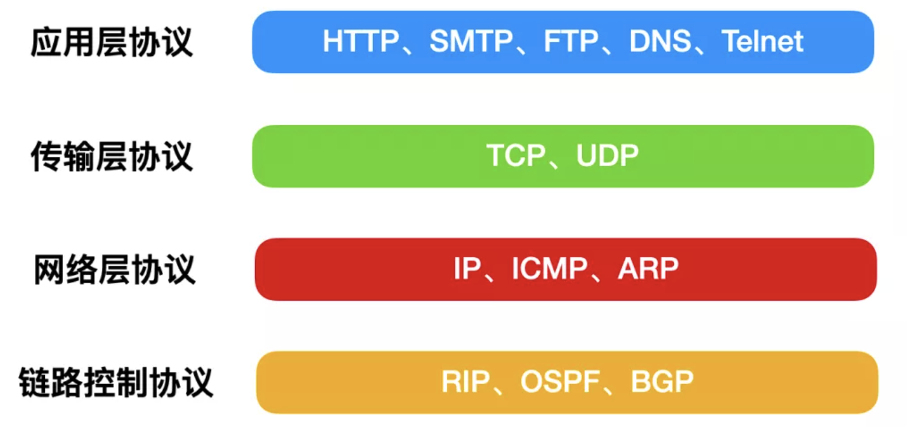
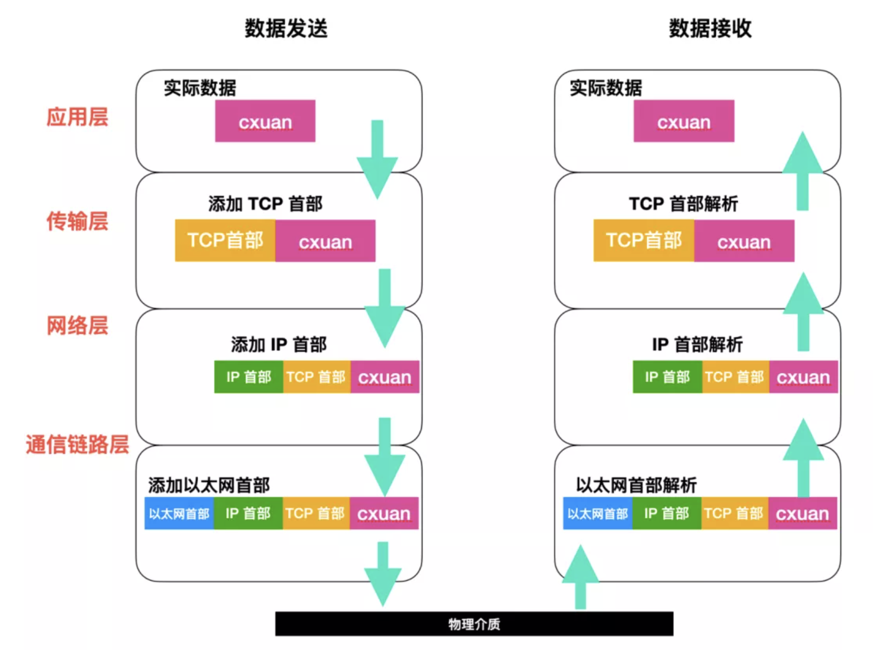

# 各层协议

# http
> 参考链接：https://juejin.cn/post/6844904045572800525
> https://mp.weixin.qq.com/s?__biz=MzI0ODk2NDIyMQ==&mid=2247486408&idx=1&sn=c332ae7ae448f3eb98865003ecade589&chksm=e999fedadeee77cc6281d1b170bd906b58220d6cd83054bc741821f4167f1f18ceee9ba0e449&token=1664520392&lang=zh_CN#rd
> https://juejin.cn/post/6900710442583359501#heading-29
超文本传输协议
超文本：不但可以传递文本，还可以传递图片，音频，视频等
传输：将数据从一个终端传输到另一个终端
协议：一些规范，需要共同遵守的规则
http是一个在计算机世界里专门在两点之间传输文字，图片，音频，视频等超文本数据的约定和规范
1、与http有关的协议
http属于应用层的协议，他需要其他层次协议配合完成信息的交换，在完成一次http请求和响应的过程中，需要哪些协议呢，
- TCP/IP 
TCP 是传输控制协议，http使用TCP作为通信协议，因为TCP 是一种可靠的协议，他能保证数据不丢失
IP协议主要解决通信双方寻址问题
- DNS
全称是域名系统，他作为将域名和IP 地址相互映射的一个分布式数据库，能够使人更方便的访问互联网
- URI/URL
URI 统一资源标识符，能够唯一的标记互联网资源
URL 统一资源定位符 是URI的一个子集
URI包含URL和URN（统一资源名称）
2、http请求特性
- 简单快速：只需选送请求方法和路径
- 灵活：http允许传输任意类型 的数据对象，正在传输的类型由Content-Type加以标记
- 无连接：每次请求只处理一个请求，服务器处理完请求后，并收到客户的应答后即断开连接，采用这种方式可以节省传输时间
- 无状态：无状态是指对于事务处理没有记忆能力，缺少状态意味着如果后续处理需要前面的信息，则它必须重传，这样可能导致每次连接传送的数据量增大

# UDP 
UDP不靠谱的原因是他虽然提供差错检测的功能，但是对于差错没有恢复能力更不会有重传机制

# TCP
TCP会把数据流切割成一段段的字节流，比如主机A给主机Bfansong一条数据，数据经过应用层产生一串数据流，数据流会经过TCP 分割，分割 的依据是MSS（报文段最大数据长度），假设数据是 10000 字节，MSS 是 2000 字节，那么 TCP 就会把数据拆分成 0 - 1999 , 2000 - 3999 的段，依次类推。
所以，第一个数据 0 - 1999 的首字节编号就是 0 ，2000 - 3999 的首字节编号就是 2000 。。。。。。

## TCP与UDP区别：

TCP是面向连接的协议，发送数据前要先建立连接，TCP提供可靠的服务，也就是说，通过TCP连接传输的数据不会丢失，没有重复，并且按顺序到达；

UDP是无连接的协议，发送数据前不需要建立连接，是没有可靠性；

TCP通信类似于于要打个电话，接通了，确认身份后，才开始进行通行；

UDP通信类似于学校广播，靠着广播播报直接进行通信。

TCP只支持点对点通信，UDP支持一对一、一对多、多对一、多对多；

TCP是面向字节流的，UDP是面向报文的；
面向字节流是指发送数据时以字节为单位，一个数据包可以拆分成若干组进行发送，而UDP一个报文只能一次发完。

TCP首部开销（20字节）比UDP首部开销（8字节）要大

UDP 的主机不需要维持复杂的连接状态表
TCP和UDP的应用场景：

对某些实时性要求比较高的情况使用UDP，比如游戏，媒体通信，实时直播，即使出现传输错误也可以容忍；其它大部分情况下，HTTP都是用TCP，因为要求传输的内容可靠，不出现丢失的情况

1.4 形容一下TCP和UDP

TCP通信可看作打电话：
李三(拨了个号码)：喂，是王五吗？
王五：哎，您谁啊？
李三：我是李三，我想给你说点事儿，你现在方便吗？
王五：哦，我现在方便，你说吧。
甲：那我说了啊？
乙：你说吧。
(连接建立了，接下来就是说正事了…)

UDP通信可看为学校里的广播：
播音室：喂喂喂！全体操场集合

## 序号，确认号实现传输可靠性
TCP 报文段首部中两个最重要的字段就是 序号 和 确认号，A发送数据给B，B发送确认应答（ACK）如果有确认应答说明数据成功到达，反之数据可能丢失，如果一段时间A没有收到确认应答，则进行重发
## 利用窗口控制提高速度
一问一答的方式慢，通过窗口提高速度。引入窗口后，每次请求都可以发送多个报文段，也就是说一个窗口可以发送多个报文段。窗口大小就是指无需等待确认应答就可以继续发送报文段的最大值。
## 三次握手建立连接

## 四次挥手断开连接

# OSI模型
OSI模型一共有7层：从下到上分别是：
- 物理层、
- 数据链路层、
- 网络层、
- 传输层、
- 会话层、
- 表示层、
- 应用层
在TCP/IP协议中，被简化为4层：应用层（会话层和表示层并进应用层中），传输层，网络层，通信链路层（物理层和数据链路层）
## 传输层
传输层的协议主要分为面向有连接的协议TCP和面向无连接的协议UDP
TCP：可靠，能够保证数据包的可靠性交付，能够正确处理传输过程中的丢包，传输顺序错乱等异常情况，此外，TCP还提供拥塞控制用于缓解网络拥堵
UDP：不可靠，无需建立连接即可发送数据包，不保证数据的可靠交付，UDP不会检查数据包是否到达，网络是否阻塞等情况，但是UDP的效率比较高。UDP常用于视频通信和多媒体领域

## 数据包的发送解析历程
### 数据包的发送历程

数据包发送历程
假设主机 A 和主机 B 进行通信，主机 A 想要向主机 B 发送一个数据包，都会经历哪些奇特的操作？

应用层的处理

主机 A 也就是用户点击了某个应用或者打开了一个聊天窗口输入了cxuan，然后点击了发送，那么这个 cxuan 就作为一个数据包遨游在了网络中，等下还没完呢，应用层还需要对这个数据包进行处理，包括字符编码、格式化等等，这一层其实是 OSI 中表现层做的工作，只不过在 TCP/IP 协议中都归为了应用层。

数据包在发送的那一刻建立 TCP 连接，这个连接相当于通道，在这之后其他数据包也会使用通道传输数据。

传输层的处理

为了描述信息能准确的到达另一方，我们使用 TCP 协议来进行描述。TCP 会根据应用的指示，负责建立连接、发送数据和断开连接。

TCP 会在应用数据层的前端附加一个 TCP 首部字段，TCP 首部包含了源端口号 和 目的端口号，这两个端口号用于表明数据包是从哪里发出的，需要发送到哪个应用程序上；TCP 首部还包含序号，用以表示该包中数据是发送端整个数据中第几个字节的序列号；TCP 首部还包含 校验和，用于判断数据是否损坏，随后将 TCP 头部附加在数据包的首部发送给 IP。

网络层的处理

网络层主要负责处理数据包的是 IP 协议，IP 协议将 TCP 传过来的 TCP 首部和数据结合当作自己的数据，并在 TCP 首部的前端加上自己的 IP 首部。因此，IP 数据包后面会紧跟着 TCP 数据包，后面才是数据本身。IP 首部包含目的和源地址，紧随在 IP 首部的还有用来判断后面是 TCP 还是 UDP 的信息。

IP 包生成后，会由路由控制表判断应该发送至哪个主机，IP 修饰后的数据包继续向下发送给路由器或者网络接口的驱动程序，从而实现真正的数据传输。

通信链路层的处理

经由 IP 传过来的数据包，以太网会给数据附上以太网首部并进行发送处理。以太网首部包含接收端的 MAC 地址、发送端的 MAC 地址以及标志以太网类型的以太网数据协议等。

### 数据包的解析历程
数据包的接收流程是发送流程的逆序过程，数据包的解析同样也会经过下面这几步。

通信链路的解析

目标主机收到数据包后，首先会从以太网的首部找到 MAC 地址判断是否是发给自己的数据包，如果不是发给自己的数据包则会丢弃该数据包。

如果收到的数据包是发送给自己的，就会查找以太网类型判断是哪种协议，如果是 IP 协议就会扔给 IP 协议进行处理，如果是 ARP 协议就会扔给 ARP 协议进行处理。如果协议类型是一种无法识别的协议，就会将该数据包直接丢弃。

网络层的解析

经过以太网处理后的数据包扔给网络层进行处理，我们假设协议类型是 IP 协议，那么，在 IP 收到数据包后就会解析 IP 首部，判断 IP 首部中的 IP 地址是否和自己的 IP 地址匹配，如果匹配则接收数据并判断上一层协议是 TCP 还是 UDP；如果不匹配则直接丢弃。

注意：在路由转发的过程中，有的时候 IP 地址并不是自己的，这个时候需要借助路由表协助处理。

传输层的处理

在传输层中，我们默认使用 TCP 协议，在 TCP 处理过程中，首先会计算一下 校验和，判断数据是否被损坏。然后检查是否按照序号接收数据，最后检查端口号，确定具体是哪个应用程序。

数据被完整的识别后，会传递给由端口号识别的应用程序进行处理。

应用程序的处理

接收端指定的应用程序会处理发送方传递过来的数据，通过解码等操作识别出数据的内容，然后把对应的数据存储在磁盘上，返回一个保存成功的消息给发送方，如果保存失败，则返回错误消息。

上图中有几个字段需要重点介绍下：
（1）序号：Seq序号，占32位，用来标识从TCP源端向目的端发送的字节流，发起方发送数据时对此进行标记。
（2）确认序号：Ack序号，占32位，只有ACK标志位为1时，确认序号字段才有效，Ack=Seq+1。
（3）标志位：共6个，即URG、ACK、PSH、RST、SYN、FIN等，具体含义如下：
（A）URG：紧急指针（urgent pointer）有效。
（B）ACK：确认序号有效。
（C）PSH：接收方应该尽快将这个报文交给应用层。
（D）RST：重置连接。
（E）SYN：发起一个新连接。
（F）FIN：释放一个连接。

作者：卞卞村长L
链接：https://juejin.cn/post/6844903510119546887
来源：掘金
著作权归作者所有。商业转载请联系作者获得授权，非商业转载请注明出处。